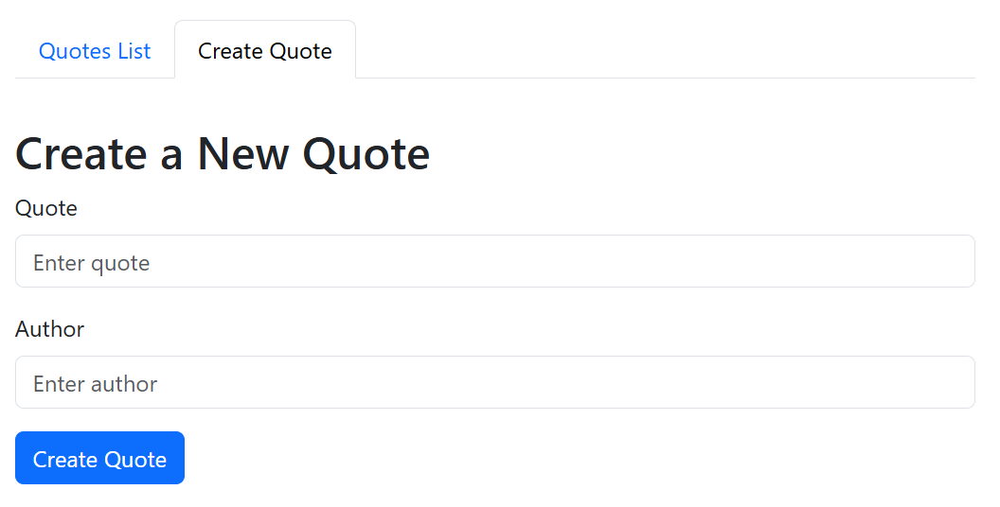

# Simple CRUD App with React, Express, and SQLite

This is a simple CRUD application with a React frontend, an Express backend, and SQLite as the database.

## Features

- **Create a Quote**
- **Read (List) Quotes**
- **Edit a Quote**
- **Delete a Quote**

## Screenshots





## Folder Structure

assignment-08/\
├── backend/\
│&nbsp;&nbsp;&nbsp;&nbsp;&nbsp;&nbsp;└── (Backend files for Express and SQLite)\
├── frontend/\
│&nbsp;&nbsp;&nbsp;&nbsp;&nbsp;&nbsp;└── (Frontend files for React)\
└── README.md\

## Setup and Installation

### Backend

#### 1. Navigate to the `backend` folder:
```bash
cd backend
```

#### 2. Install dependencies:

```bash
npm install
```

#### 3. Run the backend server:

```bash
npm run dev
```

### Frontend

#### 1. Navigate to the `frontend` folder:
```bash
cd frontend
```

#### 2. Install dependencies:

```bash
npm install
```

#### 3. Run the frontend server:

```bash
npm run dev
```

## Database

The backend uses an SQLite database to store quotes. The database will be created automatically when you run the backend for the first time.

## Technologies Used

**- Frontend:**
   - React
   - React Query
   - Bootstrap

**- Backend:**
   - Express
   - Sequelize (SQLite)
   