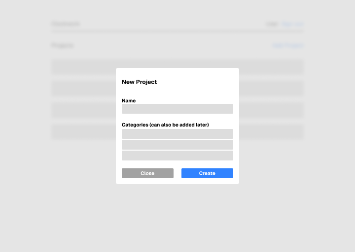

# Phase 1 — Definition and planning

This project is a simple time tracking web application that allows users to create projects and log the hours they've worked on them. It helps individuals or freelancers keep track of their work time, view time logs, and manage productivity. The app includes basic features like project creation, time logging, and user authentication through login and registration.

## 1. User Personas

### **User Persona 1:** Alex – The Freelancer

Works on multiple projects for different clients and needs to keep accurate records of time spent on each one.

**Goals:** Stay organized and bill clients correctly based on actual hours worked.

**Needs:** A simple way to create projects, log hours quickly, and view total time per project.

### **User Persona 2:** Maya – The Student

Balancing study sessions across different subjects and wants to manage time more efficiently.

**Goals:** Wants to manage her study time better by tracking how much time she spends on each subject or assignment.

**Needs:** A clean interface to create subjects as *"projects"* and log study sessions easily.

### **User Persona 3:** James – The Startup Founder

*This user persona is not covered in this version of the project. Perhaps, in a future updated version.*

Leading or coordinating a small group of people and wants visibility into how time is being spent across tasks.

**Goals:** Wants to monitor how his small team is spending time on different internal projects.

**Needs:** A basic team-friendly setup where each member can log time, and he can view the logs per project.

## 2. Use Cases and User Flows

### **Use Case 1:** User Registration

**Goal:** Allow a new user to create an account.

**User Flow:**

1. User opens the app.
2. Clicks "Register" or "Sign Up".
3. Enters name, email, and password.
4. Clicks "Register".
5. Account is created, and the user is redirected to the dashboard.

### **Use Case 2:** User Login

**Goal:** Allow a returning user to access their account.

**User Flow:**

1. User opens the app:
   * If the user is already signed in, user is redirected to their dashboard.
   * Else display login page.
2. Enters email and password.
3. Clicks "Login".
4. If credentials are valid, user is redirected to their dashboard.

### **Use Case 3:** Add a New Project

**Goal:** Allow the user to create a new project where they can track time.

**User Flow:**

1. User logs into the app.
2. User clicks on "Add New Project" button.
3. User enters project details (name, description, start date, etc.).
4. User clicks "Save" to create the project.
5. The project is displayed on the main dashboard.

### **Use Case 4:** Log Time for a Project

**Goal:** Allow the user to log hours worked on a project.

**User Flow:**

1. User logs into the app.
2. User navigates to the "Projects" page.
3. User selects the project they want to log time for.
4. User clicks on the "Log Time" button.
5. User enters time spent (e.g., hours and minutes) and a brief description of the task.
6. User clicks "Save".
7. The logged time is added to the project’s timeline.

### **Use Case 5:** View Time Logged on a Project

**Goal:** Allow the user to view how much time they've logged for a specific project.

**User Flow:**

1. User logs into the app.
2. User navigates to the "Projects" page.
3. User selects a project.
4. The project’s page displays a list of all logged time entries, showing hours worked and descriptions.
5. User can scroll through the logged time to see total hours worked on the project.

### **Use Case 6:** Edit a Time Entry

**Goal:** Allow the user to modify a previously logged time entry.

**User Flow:**

1. User logs into the app.
2. User navigates to the "Projects" page.
3. User selects a project and views time entries.
4. User clicks on a specific time entry they want to edit.
5. User modifies the time (e.g., adjusts the number of hours or updates the task description).
6. User clicks "Save" to update the entry.
7. The time entry is updated with the new details.

### **Use Case 7:** Delete a Time Entry

**Goal:** Allow the user to delete a previously logged time entry.

**User Flow:**

1. User logs into the app.
2. User navigates to the "Projects" page.
3. User selects a project and views time entries.
4. User clicks on the "Delete" button next to a time entry.
5. User confirms the deletion.
6. The time entry is removed from the project’s timeline.

## 3. UI Prototypes

The UI prototypes for this project were designed using Figma to visualize the user interface and overall flow. While not all sections of the app are included in the prototypes, they cover the core functionality needed to start the development phase. Screenshots of each page will also be provided to give a clear overview of the design. You can explore the Figma prototypes using the link below:

[Figma Prototypes](https://www.figma.com/design/L2PaW54fwxRPpieQkZVmew/AWD-Project?node-id=0-1&t=b2ENA6OCKl7mE2I1-1)

**Screenshots**

## 4. Information Architecture and Technical Design

This time tracking web application is built using **Next.js**, a full-stack React framework that powers both the frontend and backend. It supports hybrid rendering with Server-Side Rendering (SSR) and Client-Side Rendering (CSR), enabling fast performance and a smooth user experience. API routes handle server-side logic like authentication and database interaction.

The frontend is styled using **Tailwind CSS**, a utility-first CSS framework, and enhanced with **shadcn/ui** components for clean, accessible UI elements. These tools streamline the design process and maintain consistency across the app.

For data persistence, the app uses **PostgreSQL** as the primary database, with **Drizzle ORM** handling model definitions and structured database queries.

**Better Auth** is used for authentication, offering secure and efficient user login and registration handling. The app is deployed to an **AWS EC2** instance, providing full control over the environment and flexibility for future scaling.

### Key Technologies

* **[Next.js](https://nextjs.org)** – Full-stack framework that handles frontend, backend, routing, and API logic.

* **[Tailwind CSS](https://tailwindcss.com)** – Utility-first CSS for fast, responsive UI design.

* **[shadcn/ui](https://ui.shadcn.com)** – Pre-built, accessible components for a polished and modern interface.

* **[PostgreSQL](https://www.postgresql.org)** – Relational database for storing users, projects, and time entries.

* **[Drizzle](https://orm.drizzle.team/)** – ORM used to manage models, migrations, and database interactions.

* **[Better Auth](https://www.better-auth.com)** – Handles secure authentication, login, and session management.

* **[AWS EC2](https://aws.amazon.com/pm/ec2)** – Deployment environment using containers for full server control and scalability.

## 5. Project Management and User Testing

**Key phases of the project:**

1. **Planning and Design** – Define features, create user personas, and develop wireframes for the app’s flow and design.

2. **Development** – Set up Next.js for frontend and backend, implement core features (project creation, time tracking, authentication), and integrate PostgreSQL with Sequelize.

3. **Testing and Refinement**

   * **Automated Testing:** Conduct automated testing (unit and integration tests) to ensure functionality, using **[Jest](https://jestjs.io/docs/next/testing-frameworks)**.
   
   * **User Testing:** Observe users as they complete tasks like logging time and creating projects. Conduct interviews afterward to gather qualitative feedback on usability and navigation.

4. **Deployment** – Deploy the app on AWS EC2 with containerization for scalability.