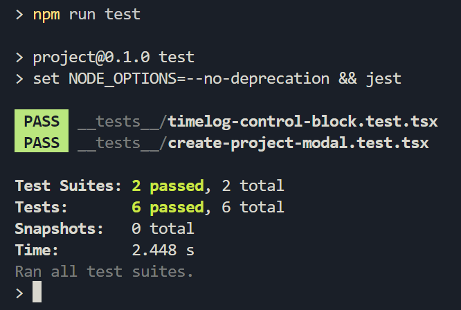
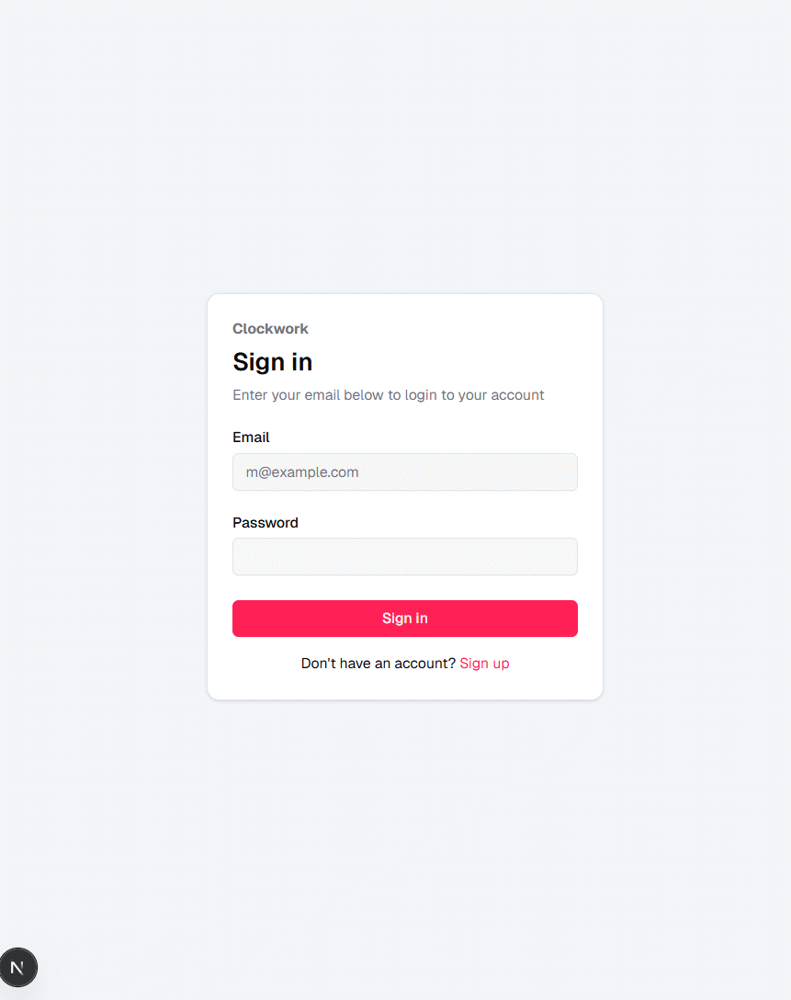

# Project phase 2 - Basic structure and main functionalities

This project is a time-tracking application where users can register, create projects, track time spent across different categories within each project, and view historical logs.

## 1. Environment

The project is deployed as a [**Node.js**](https://nodejs.org/en) server using [**Next.js**](https://nextjs.org/). The backend API and frontend are integrated into a single application, with API routes serving as the bridge between the frontend React components and the PostgreSQL database.

The project is hosted on an [**AWS EC2 instance**](https://aws.amazon.com/pm/ec2). Due to cost-saving measures, the container may not be running at all times and might be started only when needed. This means the application could experience some downtime when the container is not running.

## 2. Backend

The backend of this project is built using **Next.js**, which serves as both the web framework for the frontend and the API server. Next.js provides an efficient way to implement API routes that handle all the backend functionality of the application. These API routes are used for authentication, project management, timelog tracking, and category management.

The project uses a [**PostgreSQL**](https://www.postgresql.org/) database for data storage, and [**Drizzle ORM**](https://orm.drizzle.team/) is used as the Object-Relational Mapping (ORM) tool to interact with the database. Drizzle ORM helps in handling the database queries with an easy-to-use, type-safe API.

All API routes are structured to follow RESTful principles, ensuring consistency and predictability for all actions. The following is a list of all API endpoints available in the backend:

### Authentication Endpoints:

* `GET /api/auth/*`: Used for handling authentication-related actions, including checking if the user is logged in.
* `POST /api/auth/*`: Used for user authentication, such as login and token generation.

### Project Endpoints:

* `GET /api/projects`: Retrieves all projects associated with the authenticated user.
* `POST /api/projects`: Creates a new project for the authenticated user.
* `GET /api/projects/:projectId`: Fetches information about a specific project using the provided project ID.
* `PUT /api/projects/:projectId`: Updates the project details for a specific project.
* `DELETE /api/projects/:projectId`: Deletes the given project from the user's account.

### Timelog Endpoints:

* `GET /api/projects/:projectId/timelogs`: Retrieves a list of historical timelogs for a specific project. Pagination is supported through the ?page query parameter (default: 10 items per page).
* `POST /api/projects/:projectId/timelogs`: Creates a new active (ongoing) timelog for a project.
* `GET /api/projects/:projectId/timelogs/active`: Retrieves the currently active timelog for a specific project.
* `PATCH /api/projects/:projectId/timelogs/:timelogId`: Updates specific fields of a given timelog. It uses PATCH to allow partial updates (i.e., only modifying fields that need to be changed).
* `DELETE /api/projects/:projectId/timelogs/:timelogId`: Deletes a specific timelog entry.

### Category Endpoints:

* `GET /api/projects/:projectId/categories`: Retrieves all categories associated with a specific project.
* `POST /api/projects/:projectId/categories`: Creates new categories for a specific project.
* `PUT /api/projects/:projectId/categories/:categoryId`: Updates fields for a specific category associated with the project.
* `DELETE /api/projects/:projectId/categories/:categoryId`: Deletes a specific category and replaces its associated timelogs with another category.

## 3. Frontend

The frontend of this project is built using **Next.js**, which is a [**React**](https://react.dev/)-based framework that enables both server-side and client-side rendering. It leverages React for building dynamic, component-driven user interfaces, ensuring a smooth and interactive experience for users.

The project uses several libraries and tools to improve the development process, enhance the user interface, and add extra functionality:

* [**Shadcn UI Components**](https://ui.shadcn.com/): Shadcn UI provides a set of modern, customizable, and responsive UI components. These components are used throughout the project to build common interface elements, such as cards, buttons, modals, and form elements. They are designed with accessibility and ease of use in mind.

* [**Tailwind CSS**](https://tailwindcss.com/): Tailwind is used as the utility-first CSS framework to style the application.

* [**Lucide React Icons**](https://lucide.dev/guide/packages/lucide-react): Lucide React provides a set of lightweight icons. These icons are used throughout the application to enhance the visual representation of actions, such as edit, delete, and status indicators. Icons improve the user experience by making actions more intuitive.

* [**Recharts**](https://recharts.org/en-US/): Recharts is a charting library. In this application it is used to display a pie chart of time spent on each category for a project.

* [**Sonner**](https://sonner.emilkowal.ski/): Sonner is used to display toast notifications in the application. It provides users with feedback about their actions, such as successfully starting a timelog, saving a project, or encountering an error.

* [**Zod**](https://zod.dev/): Zod is a TypeScript-first schema validation library used for form validation. It ensures that the data submitted through forms is correctly structured and meets the required criteria. In this project Zod is used both on the frontend and backend to validate data before storing it in the database.

* [**React Query**](https://tanstack.com/query/latest/): A powerful library for data fetching, caching, and synchronization in React applications. It simplifies state management for server-side data, automating tasks like caching, background updates, and error handling.

## 4. Database

This project uses **PostgreSQL** as the database to store and manage application data. It uses **Drizzle ORM** to interact with the database. Below is the schema for each model (table):

#### **User**

| Field            | Type        | Description                                           |
|------------------|-------------|-------------------------------------------------------|
| `id`             | `text`      | Primary Key, unique identifier for the user           |
| `name`           | `text`      | User's name                                           |
| `email`          | `text`      | User's email, unique                                  |
| `email_verified` | `boolean`   | Indicates if the email is verified                    |
| `image`          | `text`      | URL to the user's profile image (optional)            |
| `createdAt`      | `timestamp` | Timestamp when the user was created                   |
| `updatedAt`      | `timestamp` | Timestamp when the user was last updated 

#### **Account**

| Field                  | Type        | Description                                                      |
|------------------------|-------------|------------------------------------------------------------------|
| `id`                   | `text`      | Primary Key, unique identifier for the account                   |
| `accountId`            | `text`      | External account identifier (e.g., OAuth ID)                    |
| `providerId`           | `text`      | Identifier for the authentication provider                       |
| `userId`               | `text`      | Foreign Key, references `user.id`, owner of the account          |
| `accessToken`          | `text`      | OAuth access token                                    |
| `refreshToken`         | `text`      | OAuth refresh token                                   |
| `idToken`              | `text`      | OAuth ID token                                        |
| `accessTokenExpiresAt` | `timestamp` | Timestamp when the access token expires                          |
| `refreshTokenExpiresAt`| `timestamp` | Timestamp when the refresh token expires                         |
| `scope`                | `text`      | The scope of access for the account                              |
| `password`             | `text`      | Password for the account                               |
| `createdAt`            | `timestamp` | Timestamp when the account was created                           |
| `updatedAt`            | `timestamp` | Timestamp when the account was last updated                      |

#### **Verification**

| Field       | Type        | Description                                                      |
|-------------|-------------|------------------------------------------------------------------|
| `id`        | `text`      | Primary Key, unique identifier for the verification              |
| `identifier`| `text`      | Identifier (e.g., email) associated with the verification        |
| `value`     | `text`      | Value associated with the verification (e.g., verification code) |
| `expiresAt` | `timestamp` | Timestamp when the verification expires                          |
| `createdAt` | `timestamp` | Timestamp when the verification was created                      |
| `updatedAt` | `timestamp` | Timestamp when the verification was last updated                 |

#### **Session**

| Field        | Type        | Description                                                      |
|--------------|-------------|------------------------------------------------------------------|
| `id`         | `text`      | Primary Key, unique identifier for the session                   |
| `expiresAt`  | `timestamp` | Timestamp when the session expires                               |
| `token`      | `text`      | Unique token for the session                                     |
| `createdAt`  | `timestamp` | Timestamp when the session was created                           |
| `updatedAt`  | `timestamp` | Timestamp when the session was last updated                      |
| `ipAddress`  | `text`      | IP address of the session                                        |
| `userAgent`  | `text`      | User agent information for the session                           |
| `userId`     | `text`      | Foreign Key, references `user.id`, owner of the session          |

#### **Project**

| Field         | Type        | Description                                                      |
|---------------|-------------|------------------------------------------------------------------|
| `id`          | `text`      | Primary Key, unique identifier for the project                   |
| `userId`      | `text`      | Foreign Key, references `user.id`, owner of the project          |
| `title`       | `varchar`   | Title of the project (max length 255 chars)                      |
| `description` | `text`      | Description of the project (optional)                            |
| `createdAt`   | `timestamp` | Timestamp when the project was created                           |

#### **Category**

| Field       | Type        | Description                                                      |
|-------------|-------------|------------------------------------------------------------------|
| `id`        | `text`      | Primary Key, unique identifier for the category                  |
| `projectId` | `text`      | Foreign Key, references `project.id`, project the category belongs to |
| `name`      | `varchar`   | Name of the category (max length 255 chars)                      |
| `createdAt` | `timestamp` | Timestamp when the category was created                          |


#### **Timelog**

| Field        | Type        | Description                                                      |
|--------------|-------------|------------------------------------------------------------------|
| `id`         | `text`      | Primary Key, unique identifier for the timelog                   |
| `projectId`  | `text`      | Foreign Key, references `project.id`, associated project         |
| `categoryId` | `text`      | Foreign Key, references `category.id`, associated category       |
| `description`| `text`      | Optional description for the timelog                             |
| `start`      | `timestamp` | Timestamp when the timelog started                               |
| `end`        | `timestamp` | Timestamp when the timelog ended (optional)                      |
| `createdAt`  | `timestamp` | Timestamp when the timelog was created                           |

## 5. Basic structure and architecture

The project follows a modular structure where code is organized to maintain scalability and separation of concerns. Below is an overview of the folder structure:

```
┌ /   ← Project Root
├──┬ src/   ← All source code
│  ├──┬ app/   ← Next.js routes and API
│  │  ├── api/   ← API endpoints (auth, projects, timelogs, categories)
│  │  ├── dashboard/   ← Private dashboard for authenticated users
│  │  ├── register/   ← User registration page
│  │  └── page.tsx   ← Landing and login page
│  ├──┬ components/   ← Reusable UI components
│  │  ├── blocks/   ← Section-level components
│  │  ├── modals/   ← Popup dialogs for forms and interactions
│  │  └── ui/   ← Basic UI elements (buttons, inputs)
│  ├── form-schemas/   ← Zod schemas for form validation (frontend & backend)
│  ├── lib/   ← Shared utilities (HTTP wrapper, auth, db setup, helpers)
│  ├── models/   ← Drizzle ORM models (table definitions & relations)
│  ├── mutations/   ← React Query mutations (POST, PUT, PATCH, DELETE)
│  └── queries/   ← React Query queries (GET)
```

### Core Flow

- **Routing & API**: Next.js handles both page rendering and API routes under `src/app`.  
- **UI Components**: Located in `components/`—blocks for layout sections, modals for dialogs, and basic UI elements.  
- **Validation**: Zod schemas in `form-schemas/` ensure data integrity on both client and server.  
- **Utilities**: `lib/` provides common helpers: HTTP requests (axios wrapper), authentication utilities, and database initialization.  
- **Data Models**: `models/` define database tables with Drizzle ORM, ensuring type-safe queries and migrations.  
- **Data Layer**: `queries/` and `mutations/` organize all data‑fetching (GET) and data‑modifying (POST/PUT/PATCH/DELETE) logic using React Query, keeping components declarative and side effects isolated.

## 6. Functionalities

- User registration and login via email authentication.
- Authenticated users can create new projects.
- Users can update and delete their own projects.
- Users can create categories for organizing timelogs.
- Categories can be updated or deleted.
- When deleting a category, the user must select a replacement category for existing timelogs.
- Users can start a new timelog for a selected project and category.
- Users can stop an active (ongoing) timelog.
- Timelogs can be updated or deleted.
- History of past timelogs can be viewed, with pagination.
- Users can view total time spent on a project.
- Users can view time spent per category within a project.

## 7. Code quality and documentation

In professional team-based development, **code reviews** are a crucial part of maintaining code quality. Since this project was developed solo, I used **AI-assisted code review** after implementing each major feature. Based on the suggestions, I made improvements and optimizations where appropriate.

I follow the principle that **clean and readable code should be self-explanatory**, and therefore, I avoid adding unnecessary comments that might become outdated or misaligned with the actual logic. For example, consider the following code snippet which checks project ownership:

```ts
const ownership = await verifyProjectOwnership(projectId, session.user.id);
if (!ownership.ok) {
  return ownership.response;
}
```

This logic is simple and clearly expresses its intent, eliminating the need for inline comments.

However, I did add short and helpful comments where they genuinely add value, especially in more complex sections. Additionally, each API endpoint has a short descriptive comment explaining its purpose. For instance:

```ts
/**
 * Retrieves a specific project by ID for the authenticated user.
 */
export async function GET(...) { ... }
```

This balance between clear code and minimal yet useful documentation ensures the project is maintainable and easy to understand without being cluttered.

## 8. Testing and error handling

### Testing

To ensure the core features of the application work correctly, I performed manual testing across all critical flows, including:

* User registration and login
* Creating, updating, and deleting projects
* Starting, updating, and stopping active timelogs
* Creating, editing, and deleting historical timelogs

Each of these features was tested step-by-step to confirm expected behavior, and all tests passed successfully.

In addition to manual testing, I implemented automated tests using [**Jest**](https://jestjs.io/) for two key components: `CreateProjectModal` and `TimelogControlBlock`. These components were chosen as they encapsulate important user flows and interactions. The tests help demonstrate how test cases can be structured and extended to other parts of the application.

Due to time constraints and the short project deadline, I was not able to cover all components with automated tests. However, the included test cases serve as a good reference for how one could scale up test coverage in a larger production environment.

#### **Features Covered by Automated Tests**

**CreateProjectModal**

* Allows user to fill in the form and submit successfully

**TimelogControlBlock**

* Renders without crashing
* Disables the "Start" button when no category is selected
* Allows selecting a category and entering a description
* Calls the start mutation when the "Start" button is clicked
* Calls the update mutation when the "Stop" button is clicked

The automated test results are shown in the screenshot below:



### Error handling

Error handling is implemented in every API route via `try/catch` blocks: any unexpected errors are caught, logged, and result in a consistent JSON error response. Incoming request bodies are validated against Zod schemas, which automatically return a 422 Invalid input error with a clear validation message.

This is an example route:

```ts
/** 
 * Retrieves all projects belonging to the authenticated user. 
 */
export async function GET() {
  // withAuth checks that the user is signed in.
  // If the user is not signed in, a 401 response is returned.
  return withAuth(async (session) => {
    try {
      const projects = await db
        .select()
        .from(project)
        .where(eq(project.userId, session.user.id))
        .orderBy(desc(project.createdAt));

      return NextResponse.json<Project[]>(projects);
    } catch (err) {
      console.error(
        "Error fetching projects: ", 
        err instanceof Error ? err.message : err
      );
      return NextResponse.json(
        { error: "Internal server error" },
        { status: 500 }
      );
    }
  });
}
```

## 9. User interface and interaction

The user interface is built using **shadcn/ui** components combined with **Tailwind CSS** for styling. This approach ensures a modern, responsive, and accessible design system that's easy to scale and customize.

All interactive elements like buttons, inputs, modals, and dropdowns follow consistent styling and behavior patterns provided by shadcn/ui. Tailwind utility classes are used extensively to fine-tune layout, spacing, and visual details.

The application emphasizes clarity and ease of use. Key actions such as starting/stopping timelogs, managing projects, and navigating between sections are accessible with minimal friction.

Below is a short animation showcasing the core flow of the application's user interface and how the main features come together:


