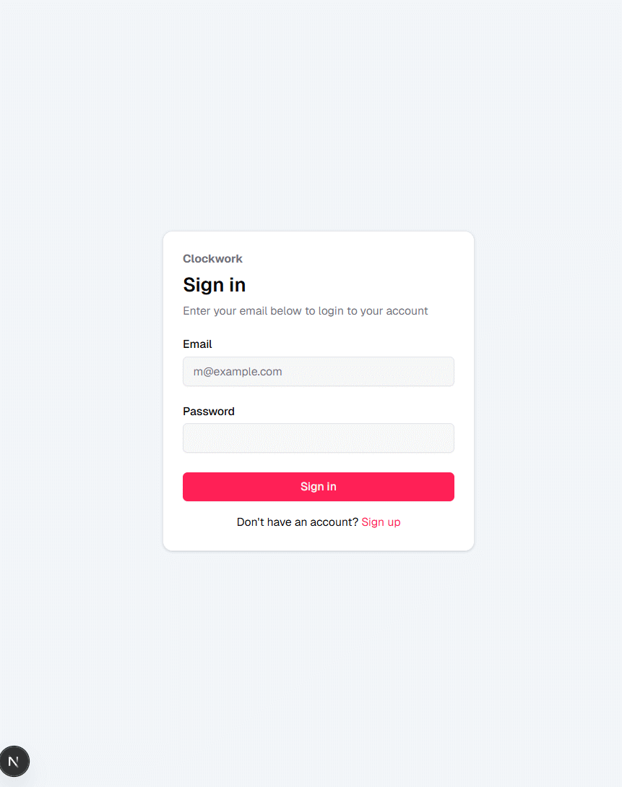

# Project phase 4 - Basic structure and main functionalities

## ⏱️ Project Title: Clockwork

## 📝 Project Overview

**Clockwork** is a simple and intuitive time tracking web app designed for freelancers, teams, and anyone who wants to stay on top of how they spend their time across multiple projects.

Users can create and manage individual projects, then break down their work into custom categories (like design, development, meetings, etc.) and log hours accordingly. The goal is to give users clear insights into where their time goes, which helps with productivity, billing, and better planning.

## 📌 Use Case Summary

Below is a summary of all use cases, including those planned during the initial phase and additional ones implemented during development. **All of the following features are implemented and working.**

| **Use Case**                                               | **Notes**                                                                 |
|----------------------------------------------------------|-------------------------------------------------------------------------------------------|
| User Registration                                        | Email-based registration, using better-auth.                                                 |
| User Login                                                    | Session based authentication using better-auth.                                              |
| Add a New Project                                            | Users can create and manage multiple projects.                                            |
| *\* Update a Project*                                  | Users can update a projects title and description.                                                           |
| *\* Delete a Project*                                          | Users can delete a project.                                                           |
| Add a Time Log entry for a Project                                     | Users can log time against a project. *\*Users can select a category to which the timelog belongs to*.                             |
| View Time Logged on a Project                                      | Total time displayed per project.                             |
| Edit a Time Entry                                                  | Users can modify logged time entries.                                                     |
| Delete a Time Entry                                              | Time entries can be deleted from the project.                                         |
| *\* Create, Edit, and Delete Categories*                                | Users can organize time entries by custom categories.                                     |
| *\* Replace Category on Deletion*                                         | Users must select a replacement category to preserve data integrity.                      |
| *\* Quick Start and Stop an Active Timelog*                                  | Supports real-time tracking by starting/stopping timers.                                  |
| *\* View Timelog History with infinite scroll pagination*                              | Timelog history is loaded and displayed using "infinite scroll".                                 |
| *\* View Time Spent per Category within a Project*                    | Breakdown of total project time by category.                                              |

**\* Additional implemented features.**

## ✍️ Technical Implementation

- **Framework:** Built with Next.js (used for both frontend and backend via API routes).
- **Backend Runtime:** Runs as a Node.js server via Next.js.
- **Database:** PostgreSQL for persistent data storage.
- **ORM:** Drizzle ORM for type-safe, developer-friendly database interactions.
- **Styling:** Tailwind CSS for utility-first, responsive design.
- **UI Components:** Shadcn UI for accessible, reusable interface elements.
- **Icons:** Lucide React for lightweight, consistent iconography.
- **Charts:** Recharts to visualize category-based time tracking.
- **Form Validation:** Zod for robust schema validation (used on both frontend and backend).
- **Notifications:** Sonner for toast feedback on user actions.
- **Data Management:** React Query for efficient server-state handling (caching, refetching, error handling).

## 🚀 Deployment & Hosting

Deployed as a Node.js app and hosted on an AWS EC2 instance. Due to cost-saving measures, the container may not be running at all times and might be started only when needed. This means the application could experience some downtime when the container is not running.

The app is available here:

[http://ec2-13-60-203-139.eu-north-1.compute.amazonaws.com:3000](http://ec2-13-60-203-139.eu-north-1.compute.amazonaws.com:3000/)

## 🚂 Development Process

The project began with a brainstorming phase to identify a realistic and meaningful app idea within a limited timeline. A time tracking application was chosen for its clear scope and practical utility.

Next.js was selected early on due to its ability to seamlessly combine frontend and backend in a single framework, along with its simple routing and developer-friendly experience.

Development started with a Minimum Viable Product (MVP) focused on core use cases like user authentication, project creation, and time logging. Once the MVP was complete, additional features, such as category management, time analytics, and live tracking were added incrementally as time allowed.

The development process went smoothly, with continuous testing and improvement throughout.

## ☀️ Reflection and Future Work

Overall, the development process went smoothly with minimal technical issues. The main challenges were staying motivated and managing the limited timeline.

While the core functionality was completed successfully, there are several areas where the app could be expanded and improved. Future enhancements could include:

- **Search and filtering**: Ability to search past timelogs by category and filter between specific date ranges.
- **Improved analytics**: More detailed reports and visual breakdowns of time usage.
- **User experience**: Further polish to the UI/UX for smoother navigation and feedback.

## 📊 Work Hours Log

| **Date** | **Hours** | **Description** |
|---|:---:|---|
| 2025-04-05 | 3 | ***Phase 1:*** Brainstorming & Prototyping. |
| 2025-04-06 | 3 | ***Phase 1:*** Brainstorming & Prototyping. |
| 2025-04-07 | 2 | Attended workshop lecture. |
| 2025-04-07 | 2 | **Phase 1:** Defining and planning the project, along with creating the initial phase documentation, which is available [here](phase1.md).|
| 2025-04-08 | 1 | **Phase 1:** Designing UI prototypes, available here: [Figma Prototypes](https://www.figma.com/design/L2PaW54fwxRPpieQkZVmew/AWD-Project?node-id=0-1&t=b2ENA6OCKl7mE2I1-1) |
| 2025-04-08 | 1 | **Start of Phase 2:** Project initialization. |
| 2025-04-10 | 5 | Sign in, sign up and sign out. Protected /dashboard was also created.. |
| 2025-04-11 | 4 | Continuing on dashboard, create project feature. |
| 2025-04-12 | 5 | Implemented toasts (Sonner). Project list and project page. |
| 2025-04-13 | 4 | Worked on timelogs. |
| 2025-04-14 | 4 | Continued working on time logs. It is now possible to add and edit timelogs per project. |
| 2025-04-15 | 2 | Timelogs and project stats. |
| 2025-04-16 | 4 | Refactoring. |
| 2025-04-17 | 5 | Refactoring & implemented feature to delete timelogs. |
| 2025-04-18 | 4 | Implemented feature to edit & delete project info & categories. |
| 2025-04-18 | 1 | Code cleanup & README.md |
| 2025-04-18 | 2 | phase2.md documentation |
| 2025-04-19 | 4 | Automated tests & phase2.md documentation |
| 2025-04-20 | 2 | AWS production build & bug fixes |
| 2025-05-15 | 2 | Phase 4 documentation |
| **Total** | **60 h** | |

## 🎥 Presentation

The project was presented live during a lecture session, and a GIF demonstrating its core functionality is included below for reference.

